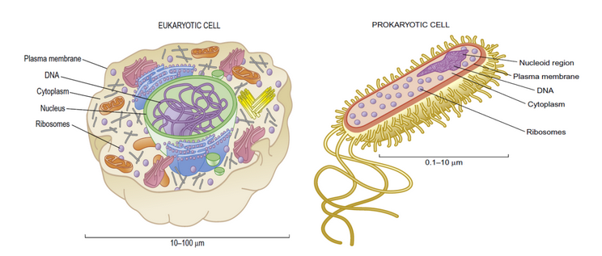
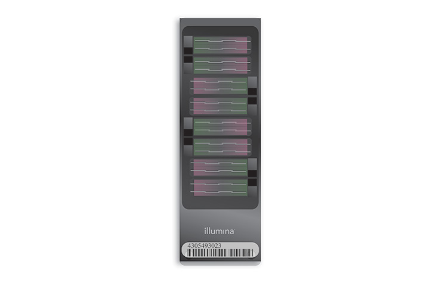
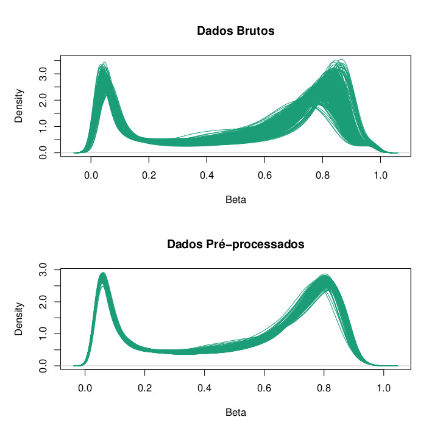

```{r setup, include=FALSE}
knitr::opts_chunk$set(echo = FALSE, fig.pos = "H")
```

\newpage

# Resumo

O presente trabalho tem como objetivo explorar as principais técnicas de pré-processamento de dados de metilação de DNA, bem como aplicar métodos de Aprendizado de Máquina não Supervisionado em dados de metilação de pacientes de Covid-19. Além disso, passaremos por algumas técnicas computacionais que nos ajudarão a cumprir com o objetivo, como o gráfico de Elbow junto a Silhueta, para definir o melhor número de clusters.

\textbf{Palavras-chave:} bioinformática, metilação de DNA, aprendizado de máquina não supervisionado, métodos de agrupamento, COVID-19, EWAS


# Introdução

Estudos recentes vêm demonstrando a importância da metilação de DNA, um marcador epigenético importante, na regulação da expressão gênica. Métodos de agrupamento ou de aprendizado de máquina não-supervisionado são utilizados para extrair informações para diagnóstico precoce e tratamentos a partir de dados de alta dimensão dos estudos epigênicos. Neste projeto, iremos aplicar métodos de agrupamento em dados de metilação de DNA de 407 pacientes de COVID-19, onde 194 (47.7\%) desses foram diagnosticados com sintomas leves e 213 (52.3\%) com sintomas severos, com o objetivo de encontrar grupos que podem ter sido formados por influência dessa doença.

Embora todas as células de um organismo apresentem, essencialmente, o mesmo conteúdo genético, suas funções e particularidades se dão por meio do regulamento da expressão gênica. Tal regulamento ocorre por meio de mecanismos epigenéticos, como a metilação do DNA, modificação de histonas e outros processos mediados por RNA, que influenciam principalmente a expressão gênica a nível de transcrição [@Gibney2010].

O mecanismo estudado é a metilação da citosina (5mC), que ocorre em áreas específicas de regulação, como regiões promotoras ou de heterocromatina. Esse fenômeno pode modificar, significativamente, a expressão temporal e espacial dos genes e a remodelação da cromatina [@Heyn2012]. Em mamíferos, as citosinas metiladas estão restritas às CpGs (citosina-fosfato-guanina), onde as mesmas antecedem uma guanina (G) na direção de 5'. Vale lembrar que quatro bases nitrogenadas compõem a formação do DNA, portanto existem 16 possibilidades para se formar um par em sequência, o que ajuda a identificar as ilhas CpGs, pois estas apresentam uma frequência maior desse par (CG) quando comparadas a outras regiões arbitrárias [@Gibney2010]. 

# Conceitos de Genética

Os primeiros conceitos de genética surgiram em meados do século XIX, através dos famosos experimentos com ervilhas conduzidos por Gregor Johann Mendel (1822 - 1884). Através de análises qualitativas e quantitativas em dados coletados durante uma década, Mendel foi capaz de mostrar que os indivíduos herdavam as características de seus pais de modo previsível, além de concluir que cada particularidade de uma ervilha é controlada por um par de fatores que segrega-se na formação dos gametas. [@klug-2019]

No entanto, a palavra "genética" foi introduzida somente em 1906, numa carta redigida pelo biólogo britânico Willian Bateson (1861-1926), com o objetivo de designar uma nova ciência de variação e hereditariedade. Baseada nos métodos probabilísticos de Mendel, essa nova era ciência era distinguida pelo seu propósito explícito de generalizar a heredirariedade. Em 1910, a genética Mendeliana fundiu-se com a Teoria Cromossômica de Herança, dando início à conhecida Genética Clássica, que se dissolveria algumas décadas depois com a descoberta do DNA como base da herança genética. Esse último evento abriu as portas para a famosa Biologia Molecular, ciência moderna que utilizamos nos dias de hoje. [@Gayon-2016]

## Biologia Molecular e Mecanismos Genéticos

## Células

Uma célula é formada por um conjunto de organelas que desempenham funções vitais para o seu funcioamento. Na imagem a seguir, é possível ver a estrutura celular de organismos eucariontes e procariontes, respectivamente. [@clark2019]

<!--
\begin{figure}[!ht]
\centering
\includegraphics[width=7.5cm, height=5cm]{../../imagens/estrutura_celular_2.png}
\caption{A figura à esquerda representa uma célula eucarionte animal. Já a figura à direita representa uma célula procarionte. \cite{clark2019}}
\end{figure}
-->

```{r estruturaCelular4, fig.cap="Célula eucarionte (animal) à esquerda e procarionte à direita.", out.width = '100%', out.height='100%'}

```

Todas as células possuem características básicas. Elas são elvolvidas pela membrana plasmática e apresentam uma substância gelatinosa, denominada citosol, que suspende os componentes celulares. No entanto, a maior diferença entre uma célula procariota e eucariota se dá na localização de seu DNA, pois em uma célula eucarionte, a maior parte do conteúdo genético está presente no núcleo, protegido por uma membrana, enquanto que na procarionte, não temos um núcleo real ou uma membrana com a função de proteção. [@reece-2020]

## DNA

O DNA (Ácido Desoxirribonucleico) é a principal molécula portadora de informações dentro de uma célula, e sua estrutura se dá pela famosa dupla-hélice. Uma molécula de DNA de fita única, também chamada de polinucleotídeo, é uma cadeia de pequenas moléculas denominadas nucleotídeos. É comum utilizar o termo "base nitrogenada" para se referenciar a um nucleotídeo. 

Existem 4 diferentes nucleotídeos, que estão distribuídas em dois grupos; as purinas e as piridiminas. As purinas são as guaninas e adeninas, representadas respectivamente pelas letras G e A. O grupo das piridiminas é formato pelas citosinas e timinas, representadas respectivamente pelas letras C e T. Os polinucleotídeos podem ser formados por qualquer sequência de bases e podem assumir tamanhos diversos. Além disso, em uma dupla hélice, as duas fitas de polinucleotídeos se ligam através da seguinte forma: C liga com G e A liga com T.

O fim de um polinucleotídeo é marcado por 5' ou 3'. Por convensão, uma fita de DNA é escrita com 5' no polo esquerdo e 3' no polo direito, de tal forma que dois polinucleotídeos são complementares se um pode ser obtido pelo outro através da troca mutual de A por T e C por G.
[@Brazma-2001]

## RNA

Assim como o DNA, uma molécula de RNA (Ácido Ribonucleico) é formada por cadeias de nucleotídeos, mas utiliza a uracila (U) no lugar da timina (T). Essa diferença faz com que a mesma seja formada por um único polinucleotídeo, que leva a necessidade de uma estrutura mais complexa para realizar as ligações entre as bases. [@Brazma-2001]

Existem diferentes moléculas de RNA, que desempenham funções importantes para a síntese de proteínas dentro de uma célula. Esse processo pode ser majoritariamente dividido em duas etapas; transcrição e tradução. De forma resumida, uma enzima, denominada RNA polimerase, inicia o processo de transcrição após reconhecer uma zona de interesse (o início de um gene, por exemplo). Após essa etapa, ela divide temporiariamente a dupla-hélice do DNA em dois polinucleotídeos e transcreve a sequência de um deles em uma molécula de RNA, que será copiada em um RNA mensageiro (mRNA). [@MartinTompa-2003]

Então, o mRNA se liga a um ribossomo e encontra o RNA transportador (tRNA), que por sua vez reconhece as informações contidas no mRNA e carrega os aminoácidos apropriados para a construção de proteínas durante a tradução. [@klug-2019]

## Cromossomos e genes

A vida depende da capacidade das células de guardar, recuperar e traduzir as instruções genéticas para gerar e manter um organismo vivo [@alberts-2002]. Essas instruções são carregadas por moléculas de DNA, que por sua vez formam as estruturas complexas denonimadas cromossomos. Nos cromossomos, o DNA se apresenta enrolado em proteínas chamadas de histonas, de tal forma que se fosse esticado alcançaria 1m de comprimento. Além disso, dentro de um organismo multicelular, todas as células carregam o mesmo conteúdo genético, com algumas poucas excessões, devido ao resultado da replicação de DNA em cada divisão celular. [@Brazma-2001]

Existem várias definições do significado de um "gene". [@Brazma-2001] aponta que um gene é um trecho contínuo de uma molécula de DNA, a partir do qual um complexo maquinário molecular pode ler informações (codificadas com as letras A, T, G e C) e fazer um tipo específico ou um conjunto de proteínas. Os genes são fundamentais em vários processos biomoleculares, como na síntese protéica, onde RNA polimerase identifica a sequência de bases de um gene específico e inicia o processo de produção das proteínas requisitadas.

Todos os seres humanos apresentam 23 pares de cromossomos, e a diferenciabilidade entre as suas células, como em qualquer organismo multicelular, ocorre através da regulação da expressão gênica, que pode silenciar determinados genes para obter tipos específicos de células (como a da pele, por exemplo).


# Epigenética e Expressão Gênica

Embora todas as células de um organismo multicelular apresentem o mesmo conteúdo genético, suas funções e particularidades ocorrem a partir do regulamento da expressão gênica. Tal regulamento ocorre por meio de mecanismos epigenéticos, como a metilação do DNA, modificação de histonas e outros processos mediados por RNA, que influenciam principalmente a expressão gênica a nível de transcrição. [@Gibney2010]

O mecanismo estudado será a metilação da citosina (5mC), que acontece em áreas específicas de regulação, como regiões promotoras ou de heterocromatina. Esse fenômeno pode modificar, significativamente, a expressão temporal e espacial dos genes e a remodelação da cromatina [@Illumina-2017]. Em mamíferos, as citosinas metiladas estão restritas às CpGs, onde elas antecedem uma guanina (G) na direção de 5'. Vale lembrar que o DNA é formado por 4 nucleotídeos e portanto existem 16 possibilidades para se formar um par em sequência, o que ajuda a identificar as ilhas CpGs, pois estas apresentam uma frequência maior desse par quando comparadas com outras regiões arbitrárias [@Gibney2010]. A figura \ref{fig:metilacao} retrata a adição do grupo metil $CH_3$ à estrutura química de uma citosina [@Saini-2013].


```{r metilacao2, fig.cap="Metilação da citosina para 5-metilcitosina, que impede sua transcrição para uracila", out.width = '50%', out.height='25%', fig.align="center"}
knitr::include_graphics("../../imagens/citosina_metilada.png")
```


# Microarranjos

Microarranjos de DNA são arranjos de estruturas fixas de ácido nucleico, chamadas de sondas, cujos padrões foram definidos durante a construção ou depositados em um substrato sólido e plano, geralmente de vidro ou silício. Essas plataformas são utilizadas para investigar a quantidade de mRNA, ou genes expressos, presente na amostra biológica sob o experimento (experimento de hibridização). Atualmente, existe uma tendência em usar o sequênciamento de genes com o objetivo de desenvolver sondas e possibilitar a fabricação de microarranjos [@scherer-2009].

# Banco de dados

O banco de dados utilizado foi retirado do estudo de associação epigenômica ampla (EWS - \textit{epigenome-wide association study}) de COVID-19 realizado por [@CastrodeMoura2021]. Os dados estão disponíveis no repositório público \textit{The Gene Expression Omnibus} (GEO), sob código de acesso GSE168739. Trata-se de 407 pacientes de COVID-19 sem comorbidades, com idade máxima de 61 anos. Os dados foram coletados através da plataforma \textit{Infinium MethylationEPIC BeadChip}, totalizando em 850 mil ilhas CpGs para cada indivíduo.

## Infinium MethylationEPIC BeadChip

O Infinium MethylationEPIC BeadChip é o novo chip da Illumina, sucessor do Illumina HumanMethylation450 (HM450) BeadChip, que cobria aproximadamente 450.000 CpGs. O novo chip cobre mais de 90% das CpGs de HM450 e um adicional de 413.743, somando mais de 850 mil ilhas. Isso é possível devido ao uso das sondas Infinium II, que necessita apenas de 2 sondas (beads) por Locus. Além disso, das 413.743 CpGs adicionais, 95% utilizam as novas sondas. A alta proporção de sondas do tipo II ocupa menos espaço, maximizando sua quantidade, porém reduz o número de amostras mensuradas pelo chip de 12 (HM450) para 8 (EPIC) [@Pidsley-2016].


```{r beadchip, fig.cap="O Infinium MethylationEPIC BeadChip apresenta > 850.000 CpGs em regiões potenciadoras, corpos gênicos, promotores e ilhas CpG. (Illumina 2015)", out.width = '100%', out.height='30%', fig.align="center"}

```


Para cada ilha CpG, o chipe registra suas intensidades de metilado e não metilado, de modo que os níveis de metilação são obtidos através da fórmula $\beta = \frac{M}{M+U}$, tal que M é a intensidade de metilado e U é a intensidade de não metilado. Outra técnica muito utilizada para medir o nível de metilação é dada por $M value = log2(\frac{M}{U})$. É muito comum somar um $\alpha$ ao denominador de $\beta$, para evitar cenários de divisão por zero quando $M + U \longrightarrow 0$ e arrumar a escala dos coeficientes [@Maksimovic2016]. 

\newpage

# Pré-processamento

O fluxo de pré-processamento será feito seguindo o passo a passo descrito no artigo "A cross-package Biodonductor workflow for analysing methylation array data" [@Maksimovic2016], por meio das ferramentas dispostas no pacote Bioconductor [@bioconductor], disponíveis para a linguagem R [@R]. Os agoritmos são aplicados na matriz de p-valores, cujo cálculo será descrito na seção seguinte. Vale enfatizar que o controle de qualidade das amostras é vital para a análise dos dados, pois permite minimizar enviesamentos e ter mais confiança em realizar alguma conclusão sobre o efeito da Covid-19 nos pacientes.

Devido a limitações computacionais para realizar as etapas de pré-processamento, esse trabalho usou recursos do Centro Nacional de Processamento de Alto Desempenho em São Paulo (CENAPAD-SP). Todos os códigos do projeto podem ser acessados no repositório dessa pesquisa presente no GitHub [@GuilhermeGit].


## Matriz de p-valores

A matriz de p-valores é obtida comparando-se a distribuição das intensidades, para cada par de indivíduos e ilhas, com a distribuição do ruído de fundo (que por sua vez, foi calculado a partir das sondas de controle). Cada um dos ensaios (tipo I e tipo II) apresenta sua distribuição própria do ruído de fundo, bem como a intensidade de metilação dos indivíduos.

Como exemplo, tomemos um indivíduo qualquer presente no banco. O primeiro passo é filtrar as sondas de controle, em cada um dos tipos de ensaios, e em seguida obter os parâmetros de três distribuições normais $\mathcal{N}(2\mu, 2\sigma^2)$ (Red, Green, Green+Red), onde $\mu$ é a mediana e $\sigma^2$ é o desvio absoluto mediano das intensidades para essas sondas. Após isso, devemos obter a intensidade de metilação total do indivíduo em cada ilha e calcular a probabilidade de cada uma dessas intensidades ser uma amostra da distribuição normal obtida no início [@Aryee2014].

## Filtro das amostras

O primeiro filtro de qualidade é aplicado com o intuito de remover as amostras de baixa qualidade. Para cada indivíduo, vemos se a média dos p-valores é menor que um nível de significância $\alpha$. Aqui, adotamos $\alpha=0.05$, por recomendação do artigo de referência.

## Normalização quantílica

A normalização quantílica [@Touleimat2012] é uma técnica de pré-processamento que realiza diversas correções no conjunto de dados. Sua pipeline é composta, respectivamente, pelas etapas de controle de qualidade, filtro das sondas, correção de sinais e normalização quantílica baseada em subconjuntos. A etapa de controle de qualidade estuda os efeitos de laboratório para estimar a qualidade das sondas e das amostras, já a etapa de filtro consiste em remover as sondas cuja variação do nível de metilação pode ocorrer devido a variações genéticas. A etapa de correção de sinais aplica uma normalização quantílica suave para corrigir possíveis problemas de marcação e escaneamento dos canais de cores. Por fim, a última etapa aplica uma normalização robusta para corrigir possíveis enviesamentos, nos valores de betas, causados pelo uso dos dois tipos de ensaios (Inf I e Inf II) no chip do experimento.

## Filtro das sondas

Nessa etapa, aplicou-se diversos filtros diferentes. O primeiro é mais simples, e cacula a média dos p-valores dos indivíduos, fixando-se ilha por ilha, e segue apenas com as CpG's que registrarem valores inferiores a $\alpha=0.01$. O segundo filtro tem como objetivo remover as sondas dos cromossomos X e Y, para evitar possíveis tendências de metilação dadas pelo sexo do paciente. 

O terceiro filtro busca remover as sondas afetadas por SNPs (Single Nucleotide Polymorphism) em seus campos, para evitar possíveis enviesamentos, pois o nível de metilação captado pelo sinal pode ser decorrente de CpGs polimórficas que sobrepuseram regiões de SNPs. Por último, é importante remover as sondas que demonstraram ser reativo-cruzadas, ou em inglês, cross-reactive, pois as mesmas se ligam a múltiplos trechos do genoma [@Chen2013].

## Resultado final

Na Figura 4, é possível ver que o pré-processamento uniformizou as densidades dos betas de cada um dos indivíduos. Portanto, temos mais confiança para dizer que os efeitos de laboratório e da coleta de dados foram reduzidos e terão menos impacto em nossas análises. Portanto, as etapas de pré-processamento consistiram em remover amostras  de baixa qualidade, aplicar a normalização quantílica e remover sondas de CpGs referentes ao sexo do paciente e/ou com reatividade cruzada.


```{r preprocess, fig.cap="Densidade das taxas de metilação antes e depois do pré-proprocessamento.", out.width = '100%', out.height='100%'}

```


# Aprendizado de Máquina Não-supervisionado

O aprendizado de máquina não-supervisionado também é conhecido como análise de cluster, ou análise de agrupamento. Uma das maiores diferenças entre aprendizado de máquina supervisionado e não-supervisionado está na falta de um target realizar o treinamento. Os pré-requisitos para aplicar as técnicas de agrupamento se dão na escolha das variáveis, hiperparâmetros e tipo de distância adotada [@Gentleman2008].


Com a matriz final dos betas pré-processados, podemos calcular a matriz de dissimilaridade entre os indivíduos por meio da distância euclidiana, dada pela fórmula 

$$
D(X,Y) = \sqrt{\sum_{i}^{n}(x_i - y_i)^2},
$$

onde $n$ é o número total de CpGs e X e Y são os vetores de betas de dois indivíduos. Cada um dos métodos foi aplicado na matriz de distâncias completa e em duas compontentes obtidas através do método Uniform Manifold Approximation and Projection (UMAP) [@mcinnes2020umap].

Para avaliar o número de grupos, utilizou-se as técnicas de Silhueta, Gráfico de Elbow e BIC.

- Silhueta: Dado um conjunto de clusteres $\Lambda$, temos que a silhueta da observação i presente no cluster $\lambda_k$ é dada por $s_{i\lambda_k} = \frac{b_i - a_i}{max(b_i, a_i)}$, onde $a_i$ é a dissimilaridade de i com relação aos elementos do cluster $\lambda_k$ (que o contém) e $b_i$ é a menor dissimilaridade de i com relação aos elementos de outro cluster $\lambda$, ou seja, $b_i = min_{\lambda \neq \lambda_k}d(i,\lambda)$ [@silhueta].


- Método de Elbow: O Método de Elbow [@hayasaka_2022] é uma curva construída a partir da Soma de Quadrados Intra-cluster, ou inércia, cuja fórmula é dada por $WSS = \sum_{k=1}^{K}\sum_{i\in S_{k}}\sum_{j=1}^{p} (x_{ij}-\bar{x}_{kj})^{2}$ [@hinduja_2015]. O melhor número de clusteres é obtido no ponto de maior inclinação da curva.


- Critérios de Informação: Para avaliar o número de grupos no método de mistura de modelos, utilizou-se o Critério de Informação Bayesiana (BIC) [@Vrieze2012-ox].


## K-Médias

O método das K-Médias [@kmeans] é uma técnica de agrupamento que funciona a partir de um parâmetro inicial, o número de clusteres. Nesse algoritmo, buscar o melhor agrupamento é entendido como buscar pela partição $\mathcal{C}_1,...,\mathcal{C}_K$ das observações, tal que se obtenha o menor valor possível para o somatório $\sum_{k=1}^{K}\frac{1}{|\mathcal{C}_k|}\sum_{i,j \in \mathcal{C}_k}d^{2}(x_i, x_j)$
[@AME].

Esse somatório representa a soma de quadrados dentro de cada cluster. O algoritmo de K-Médias é iterativo e funciona da seguinte forma: na primeira iteração, toma-se k amostras (centroids) e liga cada uma das observaçõs ao centroid mais próximo; em seguida calcula-se a média das observações de cada cluster e obtém k novos centroids. Esses passos são executados até minimizar a soma anterior.

## PAM

O algoritmo PAM - Partition Around Medoids [@pamalg] é muito similar ao K-Médias, o que o faz também ser conhecido como K-Medoids, pois o mesmo busca encontrar um "elemento central" dentro das próprias observações, chamado de medoid, que minimiza a distância entre as observações mais próximas, formando assim um cluster. Para escolher os novos medoids em cada cluster, obtêm-se o ponto que produz a menor soma de dissimilaridade com relação às outras observações. Com os novos medoids determinados, aloca-se todas as observações ao cluster mais próximo e repete as etapas anteriores. 

O medoid j, por exemplo, é dado por $c_j \in (x_1,x_2,...,x_{n-1},x_n)$, onde $x_i$ é a observação $i$. Os passos do método pam podem ser descritos da seguinte forma:

\begin{enumerate}
    \item  Escolha uma amostra de tamanho k (medoids) dentro das observações.
    \item  Para cada observação da base de dados, relacione-a com o medoid mais próximo.
    \item  Para cada cluster formado pelo medoid j, ache o elemento que reproduz a menor dissimilaridade entre os outros do mesmo grupo, e transforme-o no novo medoid.
    \item Reproduza as etapas 2 e 3 até que os medoids não mudem de uma iteração para outra.
\end{enumerate}


## Clustering Hierárquico

Os métodos de clustering hierárquico funcionam de tal forma que, dado um cojunto de g clusters, ao obtermos outro cojunto de g+1 a partir do inicial temos que ambos conjuntos de clusters apresentam g-1 grupos idênticos, e o grupo remanecente é dividido em dois. Existem diversas técnicas dessa família; as mais famosas são a de Single-Linkage, que considera a distância entre dois grupos como sendo a distância entre seus pontos mais próximos, e a Complete-Linkage, que considera a distância entre dois grupos como sendo a distância entre seus dois pontos mais distantes. Ambas as técnicas apresentam diferentes versões de agrupamentos, como a aglomerativa e a divisa [@Mardia1979].

## Modelos de Misturas Gaussianas

Misturas finitas de modelos [@Scrucca2016-sm] estão cada vez mais sendo utilizadas em diversos campos de pesquisa, como análise de agrumaneto, classificação e estimação de densidades. O método nos diz que, dado um número $G$ de variáveis aleatórias com distribuição $f_k(\textbf{x})_i$, tal que $i=1,2,3,..,G$ e $\mathbf{x}$$=${$x_1, x_2,...,x_n$} é uma amostra iid, podemos escrever a distribuição de cada uma das observações por uma função de densidade de probabilidade através de uma mistura finita de modelos de G componentes da seguinte forma

$$
f(\mathbf{x}_i;\mathbf{\Psi}) = \sum_{k=1}^{G}\pi_k f_{k}(\mathbf{x}_i;\mathbf{\theta}_k)
$$

onde $\mathbf{\Psi}$ $=$ {$\pi_1,...,\pi_{G-1}, \mathbf{\theta}_1,...,\mathbf{\theta}_G$} são os parâmetros do modelo de misturas, $f_{k}(\mathbf{x}_i;\mathbf{\theta}_k)$ é a k-ésima componente de densidade para a observação $i$ com parâmetro $\mathbf{\theta}_k$, ($\pi_1,...,\pi_{G-1}$) são os pesos ou probabilidades ($\pi_k>0$, $\sum_{k=1}^{G}\pi_k=1$) e $G$ é o número de componentes da mistura.

Assumindo que G é fixado, os parâmetros $\mathbf{\Psi}$ da mistura de modelos são, geralmente, desconhecidos e precisam ser estimados. A função do log da verossimilhança é dada por 

$$
\mathcal{L}(\mathbf{\Psi}; \mathbf{x}_1,...,\mathbf{x}_n)=\sum_{i=1}^{n}log(f(\mathbf{x}_i;\mathbf{\Psi}))=\sum_{i=1}^{n}log(\sum_{k=1}^{G}\pi_k f_{k}(\mathbf{x}_i;\mathbf{\theta}_k)).
$$
A maximização direta da verossimilhança é muito complicada devido ao logaritmo da soma. Para contornar esse problema, utiliza-se o algoritmo \textit{Expextation - Maximization}, ou simplesmente EM.

No presente trabalho, utilizou-se um modelo popuar denominado Gaussian Mixture Model (GMM), que assume uma distribuição gaussiana multivariada para cada componente, isto é, $f_k(\mathbf{x};\mathbf{\theta}_k) \sim \mathcal{N}(\mathbf{\mu}_k, \mathbf{\Sigma}_k)$. Os agrupamentos formados são elipsoidais, centrados no vetor de médias $\mathbf{\mu}_k$, com propriedades geométricas definidas pela matriz de covariâncias $\mathbf{\Sigma}_k$. O pacote mclust, utilizado na pesquisa, inicia o algoritmo aplicando-se um clustering hierárquico, para obter $\Psi_o$, e então atualiza sequencialmente as densidades buscando-se maximizar a função $\mathcal{L}(\mathbf{\Psi}; \mathbf{x}_1,...,\mathbf{x}_n)$.

## Redução de Dimensões

aa

aaa

aa

a

a

a

a

\newpage


# Resultados

Diferentes matrizes de dissimilaridade foram submetidas em cada um dos métodos comentados anteriormente, com o objetivo de verificar se existem dois grupos significativos possivelmente formados por efeito da Covid-19. Em cada um dos gráficos, os clusteres (grupos) encontrados são representados por diferentes cores, sendo amarelo e preto nas duas primeiras figuras e vermelho e azul na última.


\begin{figure}[H]
\centering
\subfloat{
  \includegraphics[width=7.5cm, height=5cm]{../../imagens/population_images/model_images/kmeans_completo.png}
}
\subfloat{
  \includegraphics[width=7.5cm, height=5cm]{../../imagens/population_images/model_images/kmeans_umap.png}
}
\caption{K-Médias: Agrupamentos encontrados através da matriz de distâncias completa (à esquerda) e através da matriz de distâncias das componentes UMAP (à direita). Em ambos os gráficos foram utilizadas as componentes do UMAP para gerar as visualizações.}
\end{figure}


\begin{figure}[!ht]
\centering
\subfloat{
  \includegraphics[width=7.5cm, height=5cm]{../../imagens/population_images/model_images/pam_complete.png}
}
\subfloat{
  \includegraphics[width=7.5cm, height=5cm]{../../imagens/population_images/model_images/pam_umap.png}
}
\caption{PAM: Agrupamentos encontrados através da matriz de distâncias completa (à esquerda) e através da matriz de distâncias das componentes UMAP (à direita). Em ambos os gráficos foram utilizadas as componentes do UMAP para gerar as visualizações.}
\end{figure}


De forma geral, os algoritmos PAM e K-Médias tiveram performances similares em termos de formação de grupos. Veja que os grupos formados lembram elipses, e por conta disso, pareceu interessante testar agrupamentos por Mistura de Modelos Gaussianos (GMM).


\begin{figure}[!ht]
\centering
\subfloat{
  \includegraphics[width=7.5cm, height=5cm]{../../imagens/population_images/model_images/model_bic_vve.png}
}
\subfloat{
  \includegraphics[width=7.5cm, height=5cm]{../../imagens/population_images/model_images/model_bic_eii.png}
}
\caption{Mistura de Modelos Gaussianos: Agrupamentos encontrados através da matriz de distâncias das componentes UMAP. EVV (à esquerda) e EII (à direita). Em ambos os gráficos foram utilizadas as componentes do UMAP para gerar as visualizações.}
\end{figure}


<!--
```{r metilacao3, fig.cap="Metilação da citosina para 5-metilcitosina, que impede sua transcrição para uracila", out.width = '100%', out.height='100%', fig.align="center"}


library(png)
library(grid)
library(gridExtra)

img1 <-  rasterGrob(as.raster(readPNG("../../imagens/population_images/model_images/kmeans_completo.png")), interpolate = FALSE)
img2 <-  rasterGrob(as.raster(readPNG("../../imagens/population_images/model_images/kmeans_umap.png")), interpolate = FALSE)
grid.arrange(img1, img2, ncol = 2)

# knitr::include_graphics(c("../../imagens/citosina_metilada.png", "../../imagens/citosina_metilada.png"))
```
-->

<!--
```{r, fig.cap="Metilação da citosina para 5-metilcitosina, que impede sua transcrição para uracila"}
library(cowplot)
ggdraw() + 
  draw_image("../../imagens/population_images/model_images/kmeans_completo.png", width = 0.5) + 
  draw_image("../../imagens/population_images/model_images/kmeans_completo.png", width = 0.5, x = 0.5)
```
-->

# Conclusão

Através dessa pesquisa, foi possível aprender diversos temas de biologia e bioinformática, bem como aprofundar em conceitos mais complexos de programação e métodos de aprendizado de máquina não-supervisionado. 

Foram exploradas diversas técnicas de agrupamentos para cada um dos métodos comentados e as conclusões finais ainda estão sendo escritas e sumarizadas. De forma geral, podemos dizer que, utilizando de todas as CpGs que restaram após a etapa de pré-processamento, não foi possível detectar formação de grupos, pois a média da silhueta ficou muito pequena em todas as técnicas. No entanto, o clustering feito nas componentes do UMAP permitiu-nos encontrar 2 grupos significativos, cuja silhueta ficou próxima de 0,5. Devido à falta da indicação acerca da gravidade da COVID-19 no banco de dados utilizado, pois essa informação não foi disponibilizada pelos autores da pesquisa, não podemos checar se os grupos formados podem ter sido decorrentes do grau dessa doença.

\newpage

# Referências


