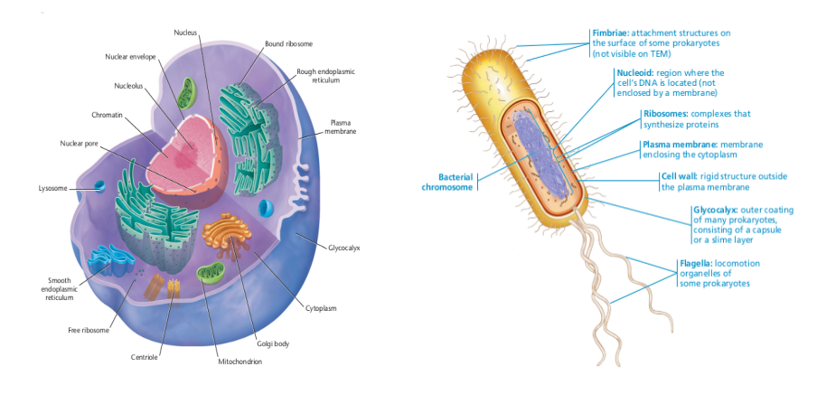

```{r setup, include=FALSE}
knitr::opts_chunk$set(echo = FALSE)
```

# Introdução

# Genética

Os primeiros conceitos de genética surgiram em meados do século XIX, através dos famosos experimentos em ervilhas conduzidos pelo biólogo Gregor Johann Mendel (1822 - 1884). Por meio de análises qualitativas e quantitativas em dados coletados durante uma década, Mendel foi capaz de mostrar que os indivíduos herdavam as características de seus pais de modo previsível, além de concluir que cada particularidade de uma ervilha é controlada por um par de fatores que segrega-se na formação dos gametas. [@klug-2019]

No entanto, a palavra "genética" foi introduzida somente em 1906, numa carta redigida pelo biólogo britânico Willian Bateson (1861-1926), com o objetivo de designar uma nova ciência de variação e hereditariedade. Baseada nos métodos probabilísticos de Mendel, essa nova era ciência era distinguida pelo seu propósito explícito de generalizar a heredirariedade. Em 1910, a genética Mendeliana fundiu-se com a Teoria Cromossômica de Herança, dando início à conhecida Genética Clássica, que se dissolveria algumas décadas depois com a descoberta do DNA como base da herança genética. Esse último evento abriu as portas para a famosa Biologia Molecular, ciência moderna que utilizamos nos dias de hoje. [@Gayon-2016]

## Introdução à Biologia Molecular e Mecanismos Genéticos

### Células

Uma célula é formada por um conjunto de organelas que desempenham funções vitais para o seu funcioamento. Na imagem a seguir, é possível ver a estrutura celular de organismos eucariontes e procariontes, respectivamente.

```{r estruturaCelular, echo=FALSE, fig.cap="A figura à esquerda é uma célula eucarionte animal (Klug et al. 2019). A figura à direita representa uma célula eucarionte (Reece 2020)", fig.pos="h", out.width = '100%', out.height='100%'}

```

Todas as células possuem características básicas. Elas são elvolvidas pela membrana plasmática e apresentam uma substância gelatinosa, denominada citosol, que suspende os componentes celulares. No entanto, a maior diferença entre uma célula procariota e eucariota se dá na localização de seu DNA, pois em uma célula eucarionte, a maior parte do conteúdo genético está presente no núcleo, protegido por uma membrana, enquanto que na procarionte, não temos um núcleo real ou uma membrana com a função de proteção. [@reece-2020]

### DNA

O DNA (Ácido Desoxirribonucleico) é a principal molécula portadora de informações dentro de uma célula, e sua estrutura se dá pela famosa dupla-hélice. Uma molécula de DNA de fita única, também chamada de polinucleotídeo, é uma cadeia de pequenas moléculas denominadas nucleotídeos. É comum utilizar o termo "base nitrogenada" para se referenciar a um nucleotídeo. 

Existem 4 diferentes nucleotídeos, que estão distribuídas em dois grupos; as purinas e as piridiminas. As purinas são as guaninas e adeninas, representadas respectivamente pelas letras G e A. O grupo das piridiminas é formato pelas citosinas e timinas, representadas respectivamente pelas letras C e T. Os polinucleotídeos podem ser formados por qualquer sequência de bases e portanto, podem assumir tamanhos diversos. Além disso, em uma dupla hélice, as duas fitas de polinucleotídeos se ligam através da seguinte forma: C liga com G e A liga com T.

O fim de um polinucleotídeo é marcado por 5' ou 3'. Por convensão, uma fita de DNA é escrita com 5' no polo esquerdo e 3' no polo direito, de tal forma que dois polinucleotídeos são complementares se um pode ser obtido pelo outro através da troca mutual de A por T e C por G.
[@Brazma-2001]

### RNA

Assim como o DNA, uma molécula de RNA (Ácido Ribonucleico) é formada por cadeias de nucleotídeos, mas utiliza a uracila (U) no lugar da timina (T). Essa diferença faz com que a mesma seja formada por um único polinucleotídeo, que leva a necessidade de uma estrutura mais complexa para realizar as ligações entre as bases. [@Brazma-2001]

Existem diferentes moléculas de RNA, que desempenham funções importantes para a síntese de proteínas dentro de uma célula. Esse processo pode ser majoritariamente dividido em duas etapas; transcrição e tradução. De forma resumida, uma enzima, denominada RNA polimerase, inicia o processo de transcrição após reconhecer uma zona de interesse (o início de um gene, por exemplo). Após essa etapa, ela divide temporiariamente a dupla-hélice do DNA em dois polinucleotídeos e transcreve a sequência de um deles em uma molécula de RNA, que será copiada em um RNA mensageiro (mRNA). [@MartinTompa-2003]

Então, o mRNA se liga a um ribosso e encontra o RNA transportador (tRNA), que por sua vez reconhece as informações contidas no mRNA e carrega os aminoácidos apropriados para a construção de proteínas durante a tradução. [@klug-2019]

### Cromossomos e genes

A vida depende da capacidade das células de guardar, recuperar e traduzir as instruções genéticas para gerar e manter um organismo vivo [@alberts-2002]. Essas instruções são carregadas por moléculas de DNA, que por sua vez formam as estruturas complexas denonimadas cromossomos. Nos cromossomos, o DNA se apresenta enrolado em proteínas chamadas de histonas, de tal forma que se fosse esticado alcançaria 1m de comprimento. O ser humano possui 23 pares de cromossomos, que formam seu genoma completo. Além disso, dentro de um organismo multicelular, todas as células carregam o mesmo conteúdo genético, com algumas poucas excessões, devido ao resultado da replicação de DNA em cada divisão celular. [@Brazma-2001]

Existem várias definições do significado de um "gene". [@Brazma-2001] aponta que um gene é um trecho contínuo de uma molécula de DNA, a partir do qual um complexo maquinário molecular pode ler informações (codificadas com as letras A, T, G e C) e fazer um tipo específico de uma proteína ou um conjunto de proteína. Assim, na síntese protéica, o RNA polimerase identifica a sequência de bases de um gene específico e inicia o processo de produção das proteínas requisitadas.

A diferenciabilidade entre células de um organismo multicelular ocorre através da regulação da expressão gênica, que pode silenciar genes específicos para obter um tipo de célula específica, como as da pele, por exemplo.

### Sequenciamento


# Epigenética

Existem múltiplos processos de silenciamento de genes, como metilação, acetilação e fosforilação.

## Acetilação

## Fosforilação

## Metilação

Como indicado anteriormente, o método abordado no presente relatório será o de metilação.


# Microarranjos

## O chip da Illumina


# Análise Exploratória de Dados de Metilação

## Pré-processamento

Os dados coletados no chip....

O pacote Bioconductor oferece diversas ferramentas de pré-processamento 

### Métodos Iterativos

### Métodos Estatísticos


# Métodos de Aprendizado de Máquina não Supervisionado

## Redução de Dimensões

### PCA

### TSNE

### UMAP

## Clustering baseado em distância

### Hierárquico

#### Divisivo 

#### Aglomerativo

## Clustering baseado em densidade

### DBSCAN

### OPTICS

## Clustering baseado em Mistura de Modelos Gaussianos (GMM)

# Referências


