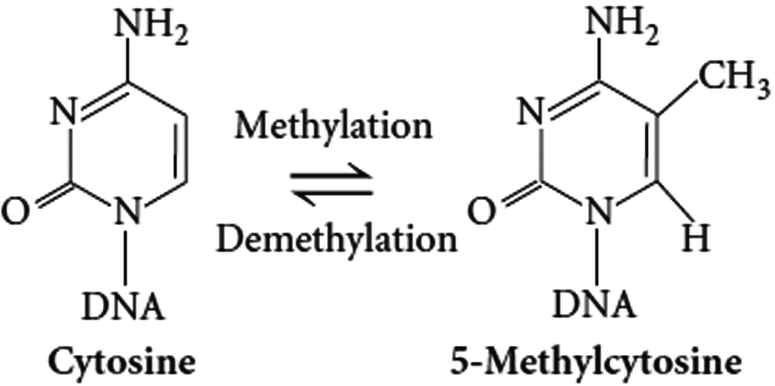
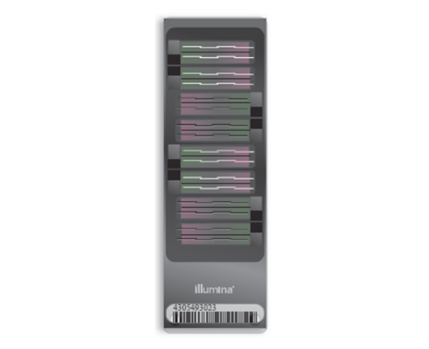

```{r setup, include=FALSE}
knitr::opts_chunk$set(echo = FALSE, fig.pos="H")
```


\newpage

# Resumo

O presente trabalho tem como objetivo explorar as principais técnicas de pré-processamento de dados de metilação de DNA, bem como utilizar e desenvolver métodos de Aprendizado de Máquina não Supervisionado em dados de metilação de pacientes de Covid-19 [@CastrodeMoura2021]. Além disso, passaremos por algumas técnicas computacionais que nos ajudarão a cumprir com o objetivo, como o UMAP (Uniform Manifold Approximation and Projection for Dimension Reduction), para redução de dimensões, e o gráfico de Elbow junto a Silhueta, para definir o melhor número de clusters. Todos os códigos desenvolvidos estão expostos no repositório do Github. \\par Palavras-chave: bioinformática, metilação de DNA, aprendizado de máquina não supervisionado, métodos de agrupamento, COVID-19, EWAS

# Introdução

Embora grande parte das células de um organismo multicelular apresente o mesmo conteúdo genético, suas funções e particularidades se dão por meio do regulamento da expressão gênica. Tal regulamento ocorre por meio de mecanismos epigenéticos, como a metilação do DNA, modificação de histonas e outros processos mediados por RNA, que influenciam principalmente a expressão gênica a nível de transcrição. [@Gibney-2010]

O mecanismo estudado será a metilação da citosina (5mC), que acontece em áreas específicas de regulação, como regiões promotoras ou de heterocromatina. Esse fenômeno pode modificar, significativamente, a expressão temporal e espacial dos genes e a remodelação da cromatina [@Illumina-2017]. Em mamíferos, as citosinas metiladas estão restritas às CpGs (cytosine-phosphate-guanine), onde elas antecedem uma guanina (G) na direção de 5'. Vale lembrar que o DNA é formado por 4 nucleotídeos e portanto existem 16 possibilidades para se formar um par em sequência, o que ajuda a identificar as ilhas CpGs, pois estas apresentam uma frequência maior desse par (CG) quando comparadas com outras regiões arbitrárias [@Gibney-2010]. <!--A figura \ref{fig:metilacao} retrata a adição do grupo metil $CH_3$ à estrutura química de uma citosina [@Saini-2013].

```{r metilacao, fig.cap="Metilação da citosina para 5-metilcitosina, que impede sua transcrição para uracila", out.width = '50%', out.height='25%', fig.align="center"}

```
-->


# Microarranjos

Microarranjos de DNA são arranjos de estruturas fixas de ácido nucleico, chamadas de sondas, cujos padrões foram definidos durante a construção ou depositados em um substrato sólido e plano, geralmente de vidro ou silício. Essas plataformas são utilizadas para investigar a quantidade de mRNA, ou genes expressos, presente na amostra biológica sob o experimento (experimento de hibridização). Atualmente, existe uma tendência em usar o sequênciamento de genes com o objetivo de desenvolver sondas e possibilitar a fabricação de microarranjos. [@scherer-2009]

## Infinium MethylationEPIC BeadChip

<!-- (Figura \ref{fig:beadchip})-->

O Infinium MethylationEPIC BeadChip é o novo chip da Illumina, sucessor do Illumina HumanMethylation450 (HM450) BeadChip, que cobria aproximadamente 450.000 CpGs. O novo chip cobre mais de 90% das CpGs de HM450 e um adicional de 413.743, somando mais de 850 mil ilhas. Isso é possível devido ao uso das sondas Infinium II, que necessita apenas de 2 sondas (beads) por Locus. Além disso, das 413.743 CpGs adicionais, 95% utilizam as novas sondas. A alta proporção de sondas do tipo II ocupa menos espaço, maximizando sua quantidade, porém reduz o número de amostras mensuradas pelo chip de 12 (HM450) para 8 (EPIC). [@Pidsley-2016]

<!--
```{r beadchip, fig.cap="O Infinium MethylationEPIC BeadChip apresenta > 850.000 CpGs em regiões potenciadoras, corpos gênicos, promotores e ilhas CpG. (Illumina 2015)", out.width = '100%', out.height='30%', fig.align="center"}

```
-->

Para cada ilha CpG, o chipe registra suas intensidades de metilado e não metilado, de modo que os níveis de metilação são obtidos a partir da seguinte forma:

$$
\beta = \frac{M}{M+U}
$$
Ta que M é a proporção de metilado e U é a proporção de não metilado. Outra técnica muito utilizada para medir o nível de metilação é dada por $M value = log2(\frac{M}{U})$. É muito comum somar um $\alpha$ ao denominador de $\beta$, para evitar cenários de divisão por zero quando $M + U \longrightarrow 0$.

# Pré-processamento

O fluxo de pré-processamento será feito seguindo o passo a passo descrito no artigo "A cross-package Biodonductor workflow for analysing methylation array data" [@Maksimovic2016], por meio das ferramentas dispostas no pacote Bioconductor [@bioconductor], disponíveis para a linguagem R [@R]. Os agoritmos são aplicados na matriz de p-valores, cujo cálculo será descrito na seção seguinte. Vale enfatizar que o controle de qualidade das amostras é vital para a análise dos dados, pois permite minimizar enviesamentos e ter mais confiança em alguma conclusão sobre o efeito da Covid-19 nos pacientes.

## Matriz de p-valores

A matriz de p-valores é obtida comparando-se a distribuição das intensidades, para cada par de indivíduos e ilhas, com a distribuição do ruído de fundo (que por sua vez, foi calculado a partir das sondas de controle). Cada um dos ensaios (combinação de canais de cores) apresenta sua distribuição própria do ruído de fundo, bem como a intensidade de metilação dos indivíduos.

Como exemplo, tomemos um indivíduo qualquer presente no banco. O primeiro passo é filtrar as sondas de controle, em cada um dos tipos de ensaios, e em seguida obter os parâmetros de três distribuições normais $\mathcal{N}(2\mu, 2\sigma^2)$ (Red, Green, Green+Red), onde $\mu$ é a mediana e $\sigma^2$ é o desvio absoluto mediano das intensidades para essas sondas. Após isso, devemos obter a intensidade de metilação total do indivíduo em cada ilha e calcular a probabilidade de cada uma dessas intensidades ser uma amostra da distribuição normal obtida no início.

## Filtro das amostras

O primeiro filtro de qualidade é aplicado com o intúito de remover as amostras de baixa qualidade. Para cada indivíduo, vemos se a média dos p-valores é menor que um nível de significância $\alpha$. Aqui, adotamos $\alpha=0.05$, por recomendação do artigo de referência.

## Normalização quantílica

A normalização quantílica [@Touleimat2012] é uma técnica de pré-processamento que realiza diversas correções no conjunto de dados. Sua pipeline é composta, respectivamente, pelas etapas de controle de qualidade, filtro das sondas, correção de sinais e normalização quantílica baseada em subconjuntos. A etapa de controle de qualidade estuda os efeitos de laboratório para estimar a qualidade das sondas e das amostras, já a etapa de filtro consiste em remover as sondas cuja variação do nível de metilação pode ocorrer devido a variações genéticas. A etapa de correção de sinais aplica uma normalização quantílica suave para corrigir possíveis problemas de marcação e escaneamento dos canais de cores. Por fim, a última etapa aplica uma normalização robusta para corrigir possíveis enviesamentos, nos valores de betas, causados pelo uso dos dois tipos de ensaios (Inf I e Inf II) no chip do experimento.

## Filtro das sondas

Nessa etapa, aplicou-se diversos filtros diferentes. O primeiro é mais simples, e cacula a média dos p-valores dos indivíduos, fixando-se ilha por ilha, e segue apenas com as CpG's que registrarem valores inferiores a $\alpha=0.01$. O segundo filtro tem como objetivo remover as sondas dos cromossomos X e Y, para evitar possíveis tendências de metilação dadas pelo sexo do paciente. 

O terceiro filtro busca remover as sondas afetadas por SNPs (Single Nucleotide Polymorphism) em seus campos, para evitar possíveis enviesamentos, pois o nível de metilação captado pelo sinal pode ser decorrente de CpGs polimórficas que sobrepuseram regiões de SNPs. Por último, é importante remover as sondas que demonstraram ser reativo-cruzadas, ou em inglês, cross-reactive, pois as mesmas se ligam a múltiplos trechos do genoma. [@Chen2013]


# Aprendizado de Máquina não Supervisionado

Falar sobre o que é aprendizado não supervisionado...

Com a matriz final dos betas pré-processados, podemos calcular a matriz de dissimilaridade entre os indivíduos por meio da distância euclidiana, dada pela fórmula $D(X,Y) = \sqrt{\sum_{i}^{n}(x_i - y_i)^2}$, onde $n$ é o número total de CpGs e X e Y são os vetores de betas de dois indivíduos.

Para escolher o número de grupos, em cada um dos métodos, utilizaremos as técnicas de Silhueta e Gráfico de Elbow.

- Silhueta: Dado um conjunto de clusteres $\Lambda$, temos que a silhueta da observação i presente no cluster $\lambda_k$ é dada por $s_{i\lambda_k} = \frac{b_i - a_i}{max(b_i, a_i)}$, onde $a_i$ é a dissimilaridade de i com relação aos elementos do cluster $\lambda_k$ (que o contém) e $b_i$ é a menor dissimilaridade de i com relação aos elementos de outro cluster $\lambda$, ou seja, $b_i = min_{\lambda \neq \lambda_k}d(i,\lambda)$ [@silhueta]. Temos evidência de formação de clusters quando a média desse score é superior a 0.4.


- Gráfico de Elbow: O Gráfico de Elbow é uma curva construída a partir da Soma de Quadrados Intra-cluster, cuja fórmula é dada por $WSS = \sum_{k=1}^{K}\sum_{i\in S_{k}}\sum_{j=1}^{p} (x_{ij}-\bar{x}_{kj})^{2}$ [@hinduja_2015]. O melhor número de clusteres é obtido no ponto de maior inclinação da curva.


## KMEANS

	2.1) Melhor número de clusters via elbow e silhueta
	2.2) Modelagem

## PAM

	3.1) Melhor número de clusters via elbow e silhueta
	3.2) Modelagem

\newpage

# Referências


