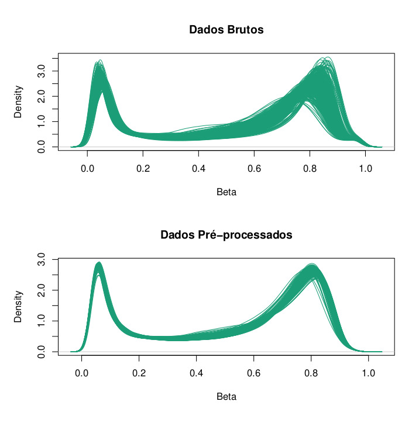

```{r setup, include=FALSE}
knitr::opts_chunk$set(echo = FALSE, fig.pos="H")
```


```{r, warning=FALSE, echo=FALSE}
library(png)
library(grid)
library(gridExtra)
```

# Introdução

Embora todas as células de um organismo apresentem, essencialmente, o mesmo conteúdo genético, suas funções e particularidades se dão por meio do regulamento da expressão gênica. Tal regulamento ocorre por meio de mecanismos epigenéticos, como a metilação do DNA, modificação de histonas e outros processos mediados por RNA, que influenciam principalmente a expressão gênica a nível de transcrição [@Gibney2010].

O mecanismo estudado foi a metilação da citosina (5mC), que acontece em áreas específicas de regulação, como regiões promotoras ou de heterocromatina. Esse fenômeno pode modificar, significativamente, a expressão temporal e espacial dos genes e a remodelação da cromatina [@Heyn2012]. Em mamíferos, as citosinas metiladas estão restritas às CpGs (citosina-fosfato-guanina), onde elas antecedem uma guanina (G) na direção de 5'. Vale lembrar que o DNA é formado por 4 nucleotídeos e portanto existem 16 possibilidades para se formar um par em sequência, o que ajuda a identificar as ilhas CpGs, pois estas apresentam uma frequência maior desse par (CG) quando comparadas com outras regiões arbitrárias [@Gibney2010].

# Banco de dados

O banco de dados utilizado foi retirado do estudo de associação epigenômica ampla (EWS - \textit{epigenome-wide association study}) de COVID-19 realizado por [@CastrodeMoura2021]. Os dados estão disponíveis no repositório público \textit{The Gene Expression Omnibus} (GEO), sob código de acesso GSE168739. Trata-se de 407 pacientes de COVID-19 sem comorbidades e com idade máxima de 61 anos, onde 194 (47.7%) estavam com sintomas leves e 213 (52.3%) estavam com sintomas graves. Os dados foram coletados através da plataforma \textit{Infinium MethylationEPIC BeadChip}, totalizando em aproximadamente 850 mil ilhas CpGs para cada indivíduo.

# Pré-processamento

O fluxo de pré-processamento foi feito seguindo o passo a passo descrito no artigo "A cross-package Biodonductor workflow for analysing methylation array data" [@Maksimovic2016], por meio das ferramentas dispostas no pacote Bioconductor [@bioconductor], disponíveis para a linguagem R [@R]. Os algoritmos são aplicados na matriz de p-valores.

A matriz de p-valores é obtida comparando-se a distribuição das intensidades, para cada par de indivíduos e ilhas, com a distribuição do ruído de fundo (que por sua vez, foi calculado a partir das sondas de controle). Cada um dos ensaios (tipo I e tipo II) apresenta sua distribuição própria do ruído de fundo, bem como a intensidade de metilação dos indivíduos.

Sem entrar em muitos detalhes, as etapas de pré-processamento consistiram em remover amostras  de baixa qualidade, aplicar a normalização quantílica [@Touleimat2012] e remover sondas de CpGs referentes ao sexo do paciente e/ou com reatividade cruzada [@Chen2013].

Devido a limitações computacionais para realizar as etapas de pré-processamento, esse trabalho usou recursos do Centro Nacional de Processamento de Alto Desempenho em São Paulo (CENAPAD-SP). 

```{r beadchip, fig.cap="Densidade das taxas de metilação antes e depois do pré-proprocessamento", out.width = '100%', out.height='100%', fig.align="center"}

```

# Aprendizado de máquina não-supervisionado

O aprendizado de máquina não-supervisionado também é conhecido como análise de cluster, ou análise de agrupamento. Uma das maiores diferenças entre aprendizado de máquina supervisionado e não-supervisionado está na falta de dados de treinamento para a última, bem como a falta de um target para tal. Os pré-requisitos para aplicar as técnicas de agrupamento se dão na escolha das variáveis, hiperparâmetros e tipo de distância adotada [@Gentleman2008].

Com a matriz final dos betas pré-processados, podemos calcular a matriz de dissimilaridade entre os indivíduos por meio da distância euclidiana, dada pela fórmula $D(X,Y) = \sqrt{\sum_{i}^{n}(x_i - y_i)^2}$, onde $n$ é o número total de CpGs e X e Y são os vetores de betas de dois indivíduos. Cada um dos métodos foi aplicado na matriz de distâncias completa e em duas compontentes reduzidas pelo método Uniform Manifold Approximation and Projection (UMAP) [@mcinnes2020umap].

Para avaliar a formação de clusteres, em cada um dos métodos, utilizou-se as técnicas de Silhueta[@silhueta] e Gráfico de Elbow [@hayasaka_2022].

Os métodos de agrupamento utilizados foram K-Médias [@kmeans], PAM - Partition Around Medoids [@pamalg], Agrupamento Hierárquico [@Mardia1979] e Mistura de Modelos.

# Resultados

```{r}
img1 <-  rasterGrob(as.raster(readPNG("../../imagens/population_images/model_images/kmeans_completo.png")), interpolate = FALSE)
img2 <-  rasterGrob(as.raster(readPNG("../../imagens/population_images/model_images/kmeans_umap.png")), interpolate = FALSE)
grid.arrange(img1, img2, ncol = 2)

```


```{r}
img1 <-  rasterGrob(as.raster(readPNG("../../imagens/population_images/model_images/pam_complete.png")), interpolate = FALSE)
img2 <-  rasterGrob(as.raster(readPNG("../../imagens/population_images/model_images/pam_umap.png")), interpolate = FALSE)
grid.arrange(img1, img2, ncol = 2)
```

```{r}
img1 <-  rasterGrob(as.raster(readPNG("../../imagens/population_images/model_images/model_bic_eii.png")), interpolate = FALSE)
img2 <-  rasterGrob(as.raster(readPNG("../../imagens/population_images/model_images/model_bic_vve.png")), interpolate = FALSE)
grid.arrange(img1, img2, ncol = 2)
```

\newpage

# Referências


